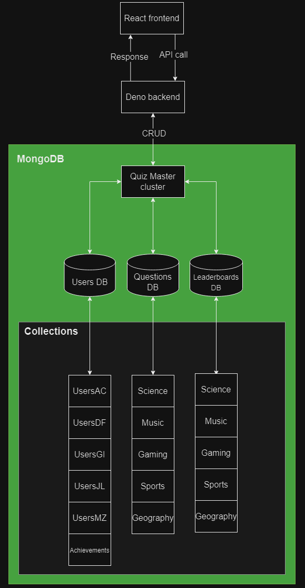

# Quiz Masters

## Overview
Quiz Masters is a real-time multiplayer quiz game platform where players can compete in themed quiz rooms. This project uses a distributed database architecture with MongoDB for scalability, high availability, and performance optimization.

## Technologies
- **Frontend**: React, Vite, RSuite
- **Backend**: Deno, Oak, Socket.IO?
- **Database**: MongoDB

---

## Roadmap
### Phase 1: User Creation & Single Player
- Implement single-player mode.
- Develop basic game logic and API endpoints.
- Set up MongoDB databases and collections.

### Phase 2: Multiplayer Features
- Introduce real-time multiplayer functionality using Socket.IO.
- Create themed quiz rooms and categories.
- Implement a ranking system and leaderboards.

### Phase 3: User Experience Enhancements
- Design and develop an intuitive user interface.
- Improve responsiveness.
- Introduce player profiles, achievements, and customization options.

### Phase 4: Testing and Deployment
- Conduct thorough testing.
- Optimize for performance and scalability.
- Deploy the application on a cloud platform.

---

## Developer Guide

Welcome to the project! This guide will help you get started and understand the key components of the codebase, divided into **backend** and **frontend** sections.

### Getting Started

1. **Clone the Repository**:
   ```bash
   git clone <repository-url>
   cd <repository-name>
   ```

2. **Set Up Environment Variables**:
   You can get the environment variables from the repository owner.

3. **Install Frontend Dependencies**:
   - For frontend:
     ```bash
     cd frontend
     deno i --allow-scripts
     ```

4. **Run the Application**:
   - Backend:
     ```bash
     cd backend
     deno run server
     ```
   - Frontend:
     ```bash
     cd frontend
     deno run dev
     ```

---

### Frontend

#### Key Tools
- **React & Vite**: Vite is used as a fast build tool for the frontend.
- **RSuite**: A UI library that provides modern components like buttons and modals for a consistent, clean UI experience.

#### Directory Structure

- **frontend/**: Contains all client-side code, including:
  - **index.html** and **main.jsx**: Entry points to the application, responsible for selecting which page to display.
  - **Pages/**: Contains each page of the application. Pages are rendered using `index.jsx`, which often imports other components for organization.
  - **Components/**: Reusable components used across the application. Page-specific components are located within their respective page folders.
  - **Data/**: Static files used to render specific components.
  - **Public/**: Stores images and other static assets.
  - **Hooks/**: Contains custom hooks that are similar to functions. They are mainly used for API calls.

#### Useful Commands

- **Deno Commands**:
   ```bash
   cd frontend
   deno run dev
   deno i npm:<package-name>
   ```

- **Vite Documentation**: [https://vitejs.dev/guide/](https://vitejs.dev/guide/)
- **RSuite Documentation**: [https://rsuitejs.com/](https://rsuitejs.com/)

---

### Backend

#### Key Tools
- **Deno**: A secure runtime for the backend.
- **Oak**: Middleware framework for handling HTTP requests in Deno.
- **MongoDB**: Used for database management.

#### Directory Structure

- **backend/**: Contains all server-side logic.
  - **Models/**: Defines schemas for accessing MongoDB.
  - **Routes/**: Handles HTTP requests from the client for CRUD operations.
  - **Scripts/**: Includes scripts for data generation to populate the database.

#### Useful Commands

- **Deno Commands**:
   ```bash
   cd backend
   deno run server
   deno i npm:<package-name>
   ```

- **Deno Documentation**: [https://deno.land/manual](https://deno.land/manual)

---

### Database Structure

The database is structured to efficiently support user profiles, game logic, and quiz data, enabling real-time interaction for multiple users in themed quiz rooms.



---

## License
This project is licensed under the [MIT License](LICENSE).